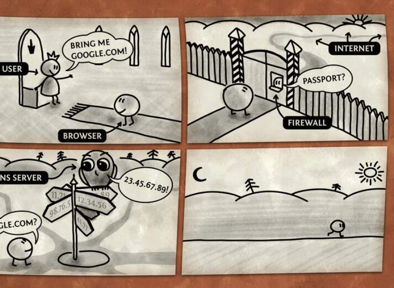
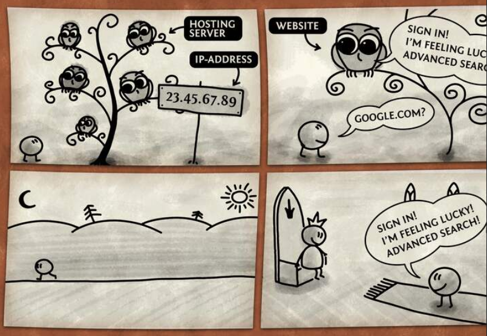

# What's Happen When...Your Type google.com in your browser and press enter

Nous le faisons des dizaines, voire des centaines de fois par jour : taper une adresse web dans notre navigateur et appuyer sur Entrée. Cette action, devenue banale, déclenche en réalité une série complexe d'événements qui font interagir une multitude de technologies.

Ce billet de blog a pour objectif de lever le voile sur ce processus apparemment simple, en vous expliquant étape par étape les rouages qui se mettent en place lorsque vous tapez `https://www.google.com` et validez. Nous explorerons ensemble les technologies clés impliquées, allant de la requête DNS à la base de données, en passant par :

- TCP/IP
- Le pare-feu
- HTTPS/SSL
- Le load balancer
- Le serveur web
- Le serveur d'applications

## Étape 1 : La requête DNS - Identifier l'adresse IP

Lorsque vous saisissez une adresse web comme `www.google.com`, votre ordinateur ne peut pas directement communiquer avec ce nom. Il a besoin de l'adresse numérique correspondante, appelée **adresse IP** (Internet Protocol), un peu comme une adresse physique pour un bâtiment. 

C'est là qu'intervient le **DNS** (Domain Name System), que l'on peut comparer à l'annuaire téléphonique d'internet. Le DNS traduit les noms de domaine lisibles par l'homme (comme `www.google.com`) en adresses IP compréhensibles par les machines (par exemple, `172.217.12.46`).

### Le processus de résolution DNS

Le processus commence par une requête DNS. Votre ordinateur envoie cette requête à un serveur DNS, souvent fourni par votre fournisseur d'accès internet (FAI) ou par un service tiers comme Google Public DNS. Ce serveur DNS, appelé **résolveur DNS**, a pour mission de trouver l'adresse IP associée au nom de domaine que vous avez demandé.

Voici les étapes typiques du processus de résolution DNS :

1. **Vérification du cache local** :  
   Votre navigateur vérifie d'abord s'il a récemment demandé cette adresse de domaine et s'il connaît déjà l'adresse IP correspondante. Si l'adresse IP est mise en cache localement, le navigateur l'utilise immédiatement, en sautant le reste du processus.

2. **Interrogation du serveur DNS récursif** :  
   Si l'adresse IP n'est pas en cache localement, une requête est envoyée à un serveur DNS récursif, généralement fourni par votre FAI ou un service tiers.

3. **Contact des serveurs racines** :  
   Le serveur récursif interroge l'un des 13 ensembles de **serveurs racines** pour trouver le serveur TLD (Top-Level Domain) pertinent pour l'extension du domaine (par exemple, `.com`, `.net`, `.org`).

4. **Connexion aux serveurs de noms TLD** :  
   En fonction de l'extension, la requête est dirigée vers le serveur de noms TLD approprié. Par exemple, une requête pour un domaine `.tech` est envoyée au serveur TLD gérant les domaines `.tech`.

5. **Interrogation des serveurs de noms faisant autorité** :  
   Le serveur récursif interroge ensuite le **serveur de noms faisant autorité** qui détient les enregistrements DNS pour le domaine spécifique. Il récupère l'adresse IP associée à ce domaine.

6. **Retour de l'adresse IP** :  
   L'adresse IP est renvoyée au navigateur, ce qui lui permet d'établir une connexion directe avec le serveur souhaité.

7. **Mise en cache** :  
   Pour améliorer l'efficacité, le serveur récursif met en cache l'adresse IP pour une période définie par le paramètre **TTL** (Time to Live) du domaine. Cela signifie que les futures requêtes pour le même domaine dans la période TTL peuvent être résolues plus rapidement sans répéter l'intégralité du processus.

Resource - [Documentation DNS par Cloudflare](https://www.cloudflare.com/learning/dns/what-is-dns/)

## Étape 2 : Établir la connexion - TCP/IP

Une fois que le navigateur a l'adresse IP du serveur de Google, il doit établir une connexion pour pouvoir échanger des données. C'est le rôle de **TCP/IP** (*Transmission Control Protocol/Internet Protocol*), la suite de protocoles de communication fondamentale d'internet. 

- **IP** est responsable de l'adressage et du routage des paquets de données sur internet
- **TCP** assure une communication fiable et orientée connexion

Chaque appareil connecté à internet possède une **adresse IP unique**, qui permet de l'identifier et de communiquer avec lui.

### Le "handshake TCP" (poignée de main TCP)

Pour établir une connexion TCP entre votre navigateur (le client) et le serveur de Google, un processus en trois étapes est utilisé :

1. **SYN** (*Synchronize*) :  
   Le client envoie un paquet SYN au serveur. Ce paquet contient :
   - Un numéro de séquence initial (ISN) généré aléatoirement
   - Indique au serveur que le client souhaite établir une connexion

2. **SYN-ACK** (*Synchronize-Acknowledge*) :  
   Le serveur répond avec un paquet SYN-ACK si :
   - Il est à l'écoute sur le port spécifié (généralement le port 443 pour HTTPS)
   - Ce paquet contient :
     - Son propre numéro de séquence initial (ISN du serveur)
     - Un accusé de réception (ACK = ISN client + 1)

3. **ACK** (*Acknowledge*) :  
   Le client envoie un dernier paquet ACK contenant :
   - ISN client + 1
   - Accusé de réception du serveur (ISN serveur + 1)

### Importance du handshake TCP

Ce processus garantit :

✔️ La synchronisation des deux extrémités  
✔️ Une communication fiable  
✔️ La livraison ordonnée des données  
✔️ La retransmission des paquets perdus  

> **Fonctionnement en couches** :  
> TCP/IP fonctionne avec :
> - **TCP** au niveau transport (fiabilité)
> - **IP** au niveau réseau (adressage et routage)
> 
> Cette séparation des responsabilités est cruciale pour l'intégrité des communications sur internet.

Resource - [TCP 3-Way Handshake Process](https://www.geeksforgeeks.org/tcp-3-way-handshake-process/)

## Étape 3 : Sécurité du réseau - Le rôle du pare-feu

Une fois la connexion TCP établie, la requête de votre navigateur doit passer par un pare-feu. Un pare-feu est un système de sécurité réseau qui surveille et contrôle le trafic entrant et sortant en fonction d'un ensemble de règles de sécurité prédéfinies. Il agit comme une barrière entre votre ordinateur ou réseau et le monde extérieur, protégeant contre les accès non autorisés, les cyberattaques et les logiciels malveillants. Les pare-feu fonctionnent en examinant chaque paquet de données qui tente de traverser la frontière du réseau. 

Les pare-feu utilisent différentes méthodes pour contrôler le trafic :

* Filtrage de paquets : Cette méthode examine les petits morceaux de données (paquets) en fonction d'un ensemble de règles. Les paquets qui correspondent aux règles sont autorisés à passer, tandis que les autres sont bloqués ou rejetés. Le filtrage peut être basé sur l'adresse IP source et de destination, le port (un numéro qui identifie une application ou un service spécifique ), et le protocole (comme TCP ou UDP ).

* Inspection avec état : Les pare-feu plus sophistiqués utilisent l'inspection avec état, qui suit l'état des connexions actives. Ils se souviennent des requêtes sortantes et s'assurent que les réponses entrantes correspondent à ces requêtes. Cela permet d'empêcher le trafic non sollicité d'atteindre votre ordinateur ou le serveur de Google.

* Service proxy : Certains pare-feu agissent comme des intermédiaires (proxies) entre votre ordinateur et internet. Au lieu de vous connecter directement au serveur web, vous vous connectez au pare-feu, qui récupère ensuite la page web pour vous. Cela peut aider à masquer votre adresse IP et à ajouter une couche de sécurité supplémentaire.

Il existe deux principaux types de pare-feu : les pare-feu matériels (souvent intégrés à votre routeur) et les pare-feu logiciels (comme le Pare-feu Windows ou des applications tierces). Dans le cas de votre requête vers Google, le trafic passera probablement par le pare-feu de votre routeur domestique ou de votre réseau d'entreprise, ainsi que par les pare-feu qui protègent l'infrastructure de Google. Les pare-feu sont configurés pour autoriser le trafic sur des ports spécifiques. Par exemple, le port 443 est généralement ouvert pour le trafic HTTPS, ce qui permet à votre navigateur de se connecter de manière sécurisée au serveur de Google.

Les pare-feu sont essentiels tant pour l'appareil de l'utilisateur que pour les serveurs de Google, créant une approche de sécurité en couches. Le pare-feu de l'utilisateur protège contre les connexions entrantes malveillantes, tandis que le pare-feu de Google protège son infrastructure. La sécurité est primordiale sur internet. Comprendre que les pare-feu fonctionnent aux deux extrémités de la connexion souligne l'importance de cette mesure de sécurité. L'inspection avec état est une technique de pare-feu plus avancée qui améliore la sécurité en s'assurant que le trafic entrant est une réponse légitime à une requête sortante, crucial pour empêcher les accès non sollicités. Cette méthode ajoute du contexte au processus de filtrage, la rendant plus efficace contre les attaques sophistiquées par rapport au simple filtrage de paquets.

Resource - [What Does a Firewall Do](https://www.paloaltonetworks.com/cyberpedia/what-does-a-firewall-do)

## Étape 4 : Communication sécurisée - HTTPS/SSL

Puisque l'adresse web que vous avez saisie commence par https://, cela indique que vous souhaitez établir une connexion sécurisée avec le serveur de Google. HTTPS (Hypertext Transfer Protocol Secure) est la version sécurisée du protocole HTTP. Le "S" signifie "Secure" et indique que la communication entre votre navigateur et le serveur sera chiffrée pour protéger vos données.

Le chiffrement est rendu possible grâce aux protocoles SSL (Secure Sockets Layer) et TLS (Transport Layer Security), TLS étant la version plus récente et plus sécurisée de SSL. HTTPS utilise TLS (ou SSL) pour chiffrer les requêtes et les réponses HTTP normales, les rendant plus sûres et sécurisées. L'objectif principal d'HTTPS est d'assurer l'authentification du site web consulté et de protéger la confidentialité et l'intégrité des données échangées pendant leur transit.

Voici les étapes principales de l'établissement d'une connexion HTTPS/SSL/TLS, souvent appelé "handshake TLS" :

1. **ClientHello** : Votre navigateur (le client) initie le handshake en envoyant un message "ClientHello" au serveur. Ce message inclut les versions de TLS supportées par le client, les suites de chiffrement (une liste d'algorithmes de chiffrement que le client comprend) qu'il supporte, et une chaîne d'octets aléatoires appelée "client random".

2. **ServerHello** : En réponse, le serveur envoie un message "ServerHello" au client. Ce message contient le certificat SSL du serveur (qui inclut la clé publique du serveur), la suite de chiffrement choisie par le serveur parmi celles proposées par le client, et un autre ensemble d'octets aléatoires appelé "server random".

3. **Authentification** : Le client vérifie le certificat SSL du serveur auprès de l'autorité de certification (CA) qui l'a émis. Cela confirme que le serveur est bien celui qu'il prétend être et que le client interagit avec le véritable propriétaire du domaine.

4. **Secret de pré-maître** : Le client génère une autre chaîne d'octets aléatoires, le "premaster secret". Le client chiffre ce secret à l'aide de la clé publique du serveur (obtenue à partir du certificat) et l'envoie au serveur. Seul le serveur, qui possède la clé privée correspondante, peut déchiffrer le premaster secret.

5. **Clés de session créées** : Le serveur déchiffre le premaster secret à l'aide de sa clé privée. Le client et le serveur utilisent ensuite le client random, le server random et le premaster secret pour générer indépendamment les clés de session. Ces clés symétriques seront utilisées pour chiffrer et déchiffrer toutes les communications ultérieures entre le client et le serveur pendant cette session sécurisée.

6. **Client terminé et Serveur terminé** : Le client envoie un message "finished" chiffré avec la clé de session pour indiquer qu'il est prêt à communiquer de manière sécurisée. Le serveur fait de même.

Une fois ce handshake terminé, une connexion chiffrée sécurisée est établie entre votre navigateur et le serveur de Google. Toutes les données échangées, telles que vos requêtes de recherche et les résultats, sont chiffrées, ce qui les protège contre l'interception par des tiers. Le "https://" au début de l'adresse web et le symbole de cadenas dans la barre d'adresse de votre navigateur indiquent qu'une connexion HTTPS sécurisée est en place. HTTPS utilise le port 443 par défaut pour les communications chiffrées.

HTTPS garantit que la communication entre le navigateur de l'utilisateur et le serveur de Google est chiffrée, protégeant les informations sensibles comme les requêtes de recherche et empêchant l'écoute clandestine par des tiers. Ceci est crucial pour la vie privée et la sécurité des utilisateurs, en particulier lors de la transmission de données personnelles. La poignée de main SSL/TLS établit non seulement une connexion chiffrée, mais authentifie également le serveur, garantissant que l'utilisateur communique bien avec le serveur Google légitime et non avec un imposteur malveillant. L'authentification est vitale pour établir la confiance et prévenir les attaques de l'homme du milieu.

Resource - [Processus de handshake TLS expliqué par Cloudflare](https://www.cloudflare.com/learning/ssl/what-happens-in-a-tls-handshake/)

## Étape 5 : Distribution de la charge - L'équilibreur de charge

Google est l'un des sites web les plus visités au monde, recevant des milliards de requêtes chaque jour. Pour gérer un tel volume de trafic, Google utilise une technique appelée "load balancing" (équilibrage de charge). Un load balancer est un dispositif ou un logiciel qui distribue le trafic réseau entrant sur plusieurs serveurs. Cela permet d'éviter qu'un seul serveur ne soit surchargé, ce qui pourrait entraîner des ralentissements ou des pannes. Les load balancers agissent comme des "agents de circulation" pour le trafic internet.

L'utilisation de load balancers présente de nombreux avantages :

* Amélioration des performances : En distribuant le trafic, les load balancers aident à garantir que les serveurs ne sont pas surchargés, ce qui se traduit par des temps de réponse plus rapides pour les utilisateurs.
* Scalabilité : Les load balancers facilitent l'ajout de nouveaux serveurs pour gérer l'augmentation du trafic, permettant à l'application de s'adapter à la demande croissante.
* Fiabilité et disponibilité : Si un serveur tombe en panne, le load balancer peut automatiquement rediriger le trafic vers les serveurs restants, assurant ainsi une disponibilité continue de l'application.

Voici comment fonctionnent généralement les load balancers :

1. Réception des requêtes : Les requêtes des utilisateurs sont d'abord dirigées vers le load balancer au lieu d'aller directement à un serveur.
2. Vérification de l'état des serveurs : Le load balancer surveille en permanence l'état de tous les serveurs disponibles pour s'assurer qu'ils sont en bonne santé et prêts à traiter les requêtes.
3. Distribution du trafic : En fonction de divers facteurs, tels que la charge du serveur, le temps de réponse ou la proximité géographique, le load balancer achemine chaque requête vers le serveur le plus approprié. Différents algorithmes peuvent être utilisés pour prendre cette décision, tels que Round Robin (distribution équitable à tour de rôle), Least Connections (envoi vers le serveur avec le moins de connexions actives), Least Response Time (envoi vers le serveur avec le temps de réponse le plus rapide) ou IP Hash (acheminement basé sur l'adresse IP du client).
4. Gestion des pannes de serveur : Si un serveur tombe en panne ou ne répond plus, le load balancer cesse automatiquement de lui envoyer du trafic et le redirige vers d'autres serveurs fonctionnels.

Dans l'infrastructure de Google, des technologies sophistiquées comme Maglev, GFE (Google Front End) et GSLB (Global Software Load Balancer) sont utilisées pour gérer l'équilibrage de charge à l'échelle mondiale.

Les load balancers sont essentiels pour la scalabilité et la résilience des services de Google, garantissant que le volume massif de requêtes des utilisateurs est traité efficacement sans qu'aucun serveur unique ne soit surchargé. La portée mondiale de Google nécessite un système robuste de distribution du trafic. L'équilibrage de charge est la clé pour maintenir la performance et la disponibilité à cette échelle. L'utilisation d'algorithmes sophistiqués d'équilibrage de charge permet une distribution intelligente du trafic basée sur divers facteurs tels que la charge du serveur, le temps de réponse et la proximité géographique, optimisant ainsi l'expérience utilisateur. Une simple distribution uniforme du trafic pourrait ne pas être l'approche la plus efficace. Les algorithmes qui tiennent compte de la santé du serveur et de la localisation de l'utilisateur peuvent conduire à de meilleures performances.

Resource - [Load Balancing - AWS Documentation](https://aws.amazon.com/what-is/load-balancing/)

## Étape 6 : Réponse du serveur web

Une fois que la requête de votre navigateur a été acheminée vers un serveur approprié par le load balancer, elle atteint un serveur web. Un serveur web est un logiciel (comme Apache ou Nginx) ou un matériel qui stocke, traite et délivre le contenu web aux utilisateurs sur internet.

Voici ce qui se passe généralement :

1. **Réception de la requête HTTP** :  
   Le serveur web reçoit la requête HTTP de votre navigateur (qui demande la page `https://www.google.com`). Cette requête, bien que sécurisée par HTTPS, suit le protocole HTTP.

2. **Localisation de la ressource demandée** :  
   Le serveur web examine la requête et identifie la ressource demandée, dans ce cas, la page d'accueil de Google (généralement un fichier HTML nommé `index.html` ou similaire) ainsi que les fichiers associés comme les feuilles de style CSS, les scripts JavaScript et les images. Le serveur web doit accéder à son espace de stockage pour trouver ces fichiers.

3. **Traitement de la requête** :  
   Le serveur web peut effectuer un certain traitement sur les fichiers demandés si nécessaire. Par exemple :
   - Pour du contenu statique : envoie les fichiers tels quels
   - Pour du contenu dynamique : peut exécuter des scripts côté serveur ou interroger une base de données

4. **Génération de la réponse HTTP** :  
   Le serveur web génère une réponse HTTP contenant :
   - Le contenu de la page web (HTML, CSS, JavaScript)
   - Les en-têtes HTTP (type de contenu, date, etc.)

5. **Envoi de la réponse au navigateur** :  
   La réponse HTTP est renvoyée à votre navigateur via la connexion TCP/IP établie, contenant le code nécessaire pour afficher la page d'accueil Google.

> **Fonctionnement clé** :  
> Les serveurs web comme Apache ou Nginx sont optimisés pour :
> - Haute disponibilité
> - Transfert de données efficace
> - Gestion simultanée de multiples requêtes
> 
> Ils assurent la fiabilité et la performance des sites web à grande échelle.

Resource - [Qu'est-ce qu'un serveur web ? - MDN Web Docs](https://developer.mozilla.org/en-US/docs/Learn_web_development/Howto/Web_mechanics/What_is_a_web_server)

## Étape 7 : Traitement applicatif - Le serveur d'applications

Bien que la page d'accueil initiale de Google puisse sembler principalement statique, elle prend en charge une vaste gamme de fonctionnalités qui pourraient impliquer l'utilisation d'un serveur d'applications. Un serveur d'applications est un logiciel qui fournit un environnement d'exécution pour les applications web, leur permettant de s'exécuter et d'exécuter du code écrit dans des langages de programmation. Il gère le contenu dynamique et la logique métier.

Contrairement à un serveur web qui est principalement conçu pour servir du contenu statique, un serveur d'applications peut gérer les interactions des utilisateurs, traiter les données et interagir avec des bases de données. Par exemple, si la page d'accueil de Google affiche un doodle personnalisé en fonction d'un événement ou de vos préférences, un serveur d'applications pourrait être impliqué dans la détermination et la diffusion de ce contenu dynamique. De même, les interactions initiales avec la barre de recherche, comme les suggestions automatiques, pourraient impliquer une communication avec un serveur d'applications.

Voici quelques exemples de tâches qu'un serveur d'applications pourrait effectuer dans le contexte de Google :

* Authentification des utilisateurs : Si vous êtes connecté à votre compte Google, un serveur d'applications gère le processus d'authentification.
* Traitement des données : Lorsque vous effectuez une recherche, le serveur d'applications traite votre requête et interagit avec les bases de données de Google pour trouver les résultats pertinents.
* Génération de contenu dynamique : Pour des fonctionnalités comme Google Actualités ou Gmail, le contenu affiché est hautement dynamique et généré par des serveurs d'applications en temps réel.

Les serveurs d'applications améliorent la sécurité, la flexibilité et la scalabilité des applications web en séparant la logique métier de la couche de présentation. Cette séparation rend l'application plus maintenable et permet une mise à l'échelle indépendante des différents composants.

Resource - [Application Servers: What They Are and How They Work - Progress](https://www.progress.com/blogs/application-servers--what-they-are-and-how-they-work)

## Étape 8 : Stockage des données - La base de données

Derrière chaque application web complexe comme Google se trouve une infrastructure de base de données robuste. Une base de données est un ensemble organisé de données stockées et accessibles électroniquement à partir d'un système informatique. Les sites web utilisent des bases de données pour stocker divers types d'informations, tels que les comptes d'utilisateurs, les détails des produits, les articles de blog et les index de recherche. Les exemples de systèmes de bases de données incluent MySQL, PostgreSQL, Oracle Database et les bases de données NoSQL comme MongoDB. Les bases de données sont essentielles pour la gestion des grandes quantités de données qui sous-tendent les applications web modernes.

Si la requête de la page d'accueil de Google nécessite l'accès à des informations dynamiques (bien que le chargement initial puisse ne pas en dépendre fortement), le serveur d'applications interagirait avec une ou plusieurs bases de données. Cette interaction implique généralement l'envoi de requêtes à la base de données pour récupérer des données spécifiques. Par exemple, si vous êtes connecté à votre compte Google, le serveur d'applications interrogerait une base de données d'utilisateurs pour récupérer vos informations personnalisées. La base de données traite la requête et renvoie les données demandées au serveur d'applications.

Google utilise probablement une variété de technologies de bases de données propriétaires et open source optimisées pour leurs besoins spécifiques et leur échelle.

Bien que la page d'accueil de Google puisse paraître simple, elle est soutenue par une infrastructure de base de données massive et complexe qui stocke et récupère les informations nécessaires à sa vaste gamme de services. La fonctionnalité principale de Google repose sur l'indexation et la recherche d'énormes quantités de données, ce qui nécessite des systèmes de base de données sophistiqués. La séparation de la couche de base de données permet une gestion et une scalabilité efficaces des données, permettant à Google de traiter des milliards de requêtes et de points de données. Une couche de base de données dédiée assure la cohérence des données et permet l'optimisation des processus de stockage et de récupération des données.

Resource - [The Purpose of a Database in Web Application Development - Holicky Corporation](https://www.holickycorporation.com/blog/the-purpose-of-a-database-in-web-application-development/)

## Conclusion

Le processus d'accès à un site web comme Google est une orchestration remarquable de multiples technologies, chacune jouant un rôle vital pour assurer une expérience utilisateur transparente. Lorsque vous tapez https://www.google.com et appuyez sur Entrée, vous déclenchez une série d'événements qui impliquent la résolution DNS pour trouver l'adresse IP de Google, l'établissement d'une connexion TCP/IP sécurisée, le passage par des pare-feu pour la sécurité, un handshake HTTPS/SSL pour le chiffrement, la distribution du trafic par des load balancers, la livraison du contenu par des serveurs web et potentiellement l'interaction avec des serveurs d'applications et des bases de données pour des fonctionnalités dynamiques. Tout cela se produit en quelques millisecondes, illustrant la puissance et les complexités cachées derrière une simple action de l'utilisateur. Comprendre ces technologies internet fondamentales fournit des informations précieuses sur le fonctionnement du monde numérique et permet aux utilisateurs de mieux naviguer et d'apprécier l'expérience en ligne.
