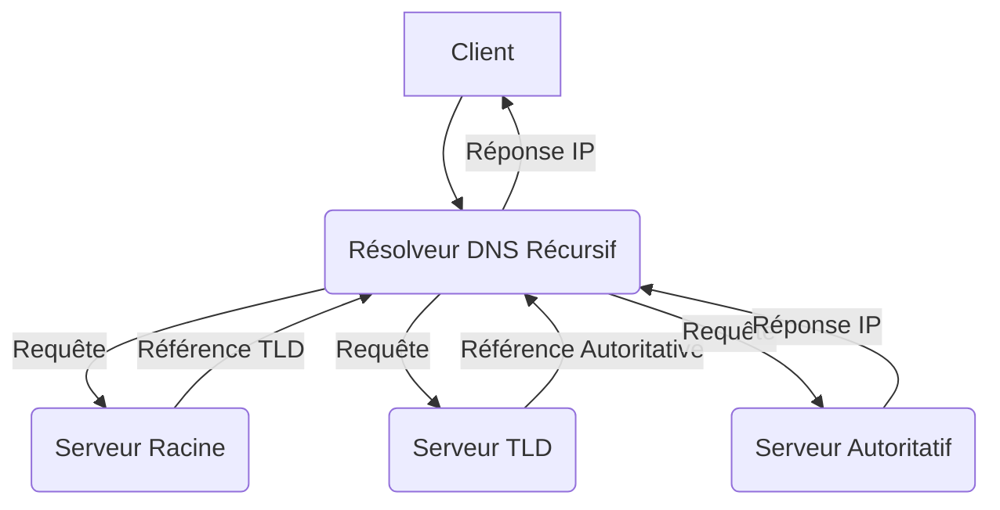

```mermaid
flowchart TD
    A[Client] --> B(Résolveur DNS Récursif)
    B -- Requête --> C(Serveur Racine)
    C -- Référence TLD --> B
    B -- Requête --> D(Serveur TLD)
    D -- Référence Autoritative --> B
    B -- Requête --> E(Serveur Autoritatif)
    E -- Réponse IP --> B
    B -- Réponse IP --> A
```