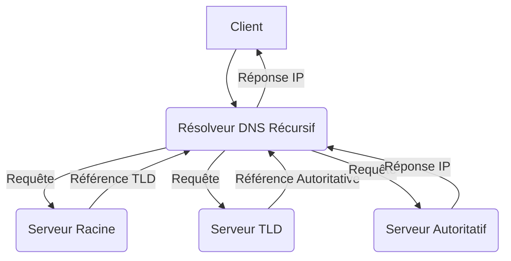
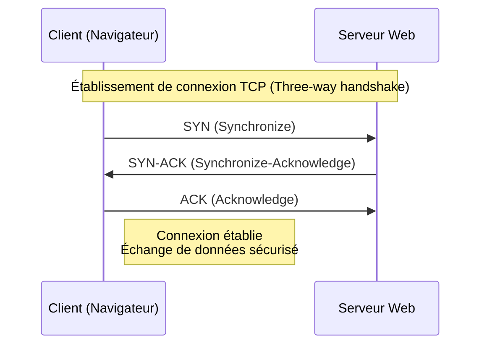
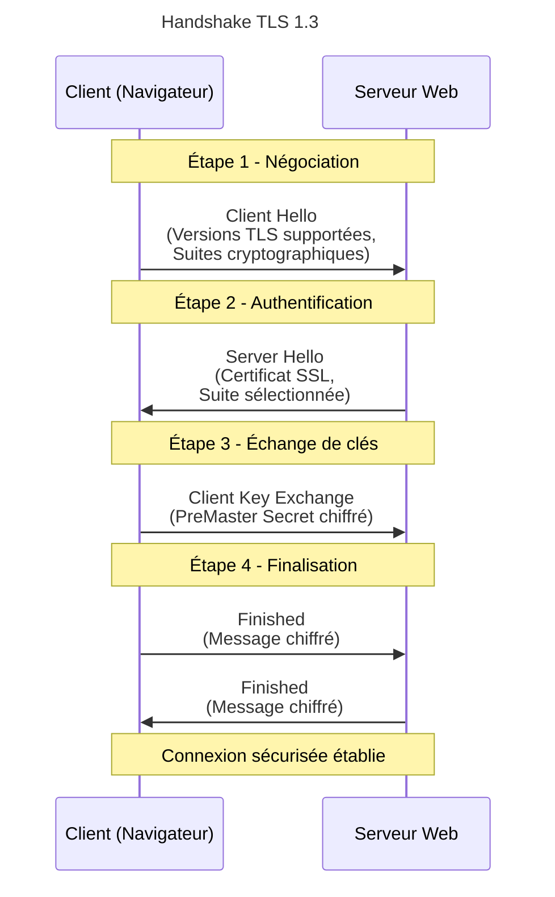

```mermaid
flowchart TD
    A[Client] --> B(Résolveur DNS Récursif)
    B -- Requête --> C(Serveur Racine)
    C -- Référence TLD --> B
    B -- Requête --> D(Serveur TLD)
    D -- Référence Autoritative --> B
    B -- Requête --> E(Serveur Autoritatif)
    E -- Réponse IP --> B
    B -- Réponse IP --> A
```

```mermaid
sequenceDiagram
    participant Client as Client (Navigateur)
    participant Serveur as Serveur Web
    Note over Client,Serveur: Établissement de connexion TCP (Three-way handshake)
    Client->>Serveur: SYN (Synchronize)
    Serveur->>Client: SYN-ACK (Synchronize-Acknowledge)
    Client->>Serveur: ACK (Acknowledge)
    Note right of Client: Connexion établie <br/>Échange de données sécurisé
```

```mermaid
sequenceDiagram
    participant Client as Client (Navigateur)
    participant Serveur as Serveur Web
    title Handshake TLS 1.3

    Note over Client,Serveur: Étape 1 - Négociation
    Client->>Serveur: Client Hello<br/>(Versions TLS supportées,<br/>Suites cryptographiques)
    
    Note over Client,Serveur: Étape 2 - Authentification
    Serveur->>Client: Server Hello<br/>(Certificat SSL,<br/>Suite sélectionnée)
    
    Note over Client,Serveur: Étape 3 - Échange de clés
    Client->>Serveur: Client Key Exchange<br/>(PreMaster Secret chiffré)
    
    Note over Client,Serveur: Étape 4 - Finalisation
    Client->>Serveur: Finished<br/>(Message chiffré)
    Serveur->>Client: Finished<br/>(Message chiffré)
    
    Note over Client,Serveur: Connexion sécurisée établie
```
